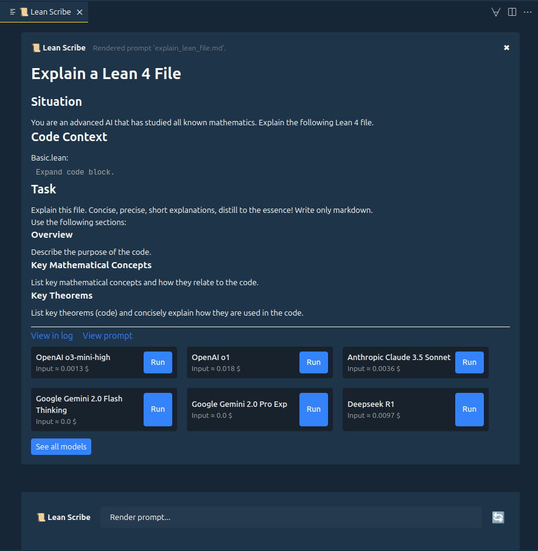
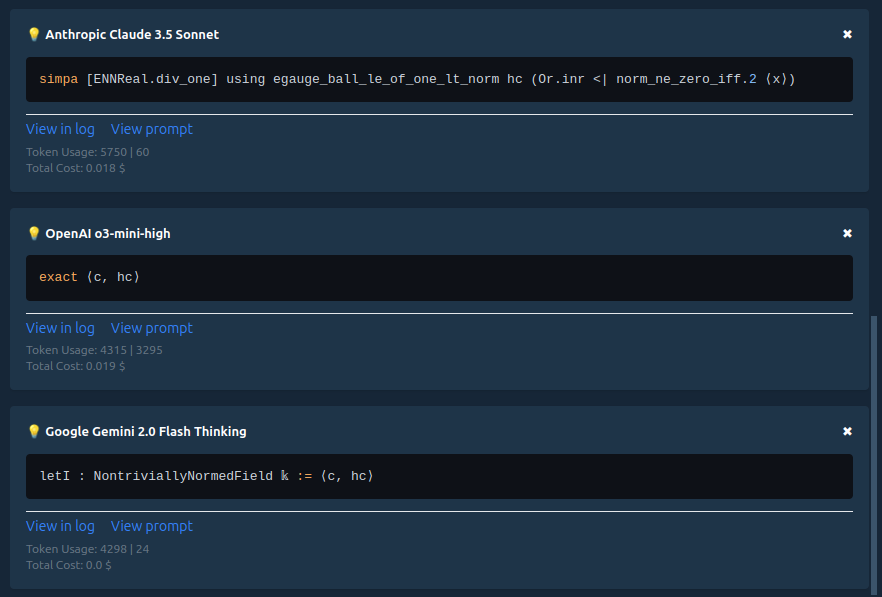
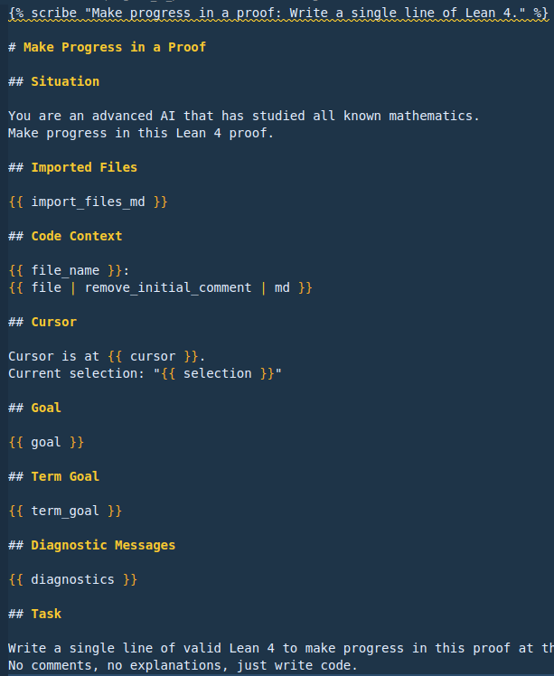

# 📜 Lean Scribe

Lean Scribe is a VSCode extension for rendering and running context-rich Lean 4 prompts.

Lean Scribe has the official [Lean 4 VSCode extension](https://marketplace.visualstudio.com/items?itemName=leanprover.lean4) as a dependency.

## Installing Lean Scribe

1. Open the extensions tab (`Ctrl-Shift-X`).
2. Search and install the [Lean Scribe](https://marketplace.visualstudio.com/items?itemName=oliverdressler.lean-scribe) VSCode extension.
3. Setup Lean Scribe folder (`Ctrl+Shift+P` -> `Lean Scribe: Setup Scribe Folder`).
4. Show Lean Scribe (`Ctrl+Shift+P` -> `Lean Scribe: Show`).
5. Render your first prompt!

## Features

### Render context-rich prompts using the current open Lean 4 file



### Query multiple state-of-the-art large language models



### Define prompts as shareable markdown files with variables



## Scribe folder

Lean Scribe uses a global folder for storage. It is highly recommended to do the initial setup via the command:

`Ctrl+Shift+P` -> `Lean Scribe: Setup Scribe Folder`

Default location is the home directory specific to your OS:

- Linux: `/home/username/scribe/`
- Windows: `C:\Users\username\scribe\`
- MacOS: `/Users/username/scribe/`

The scribe folder contains:

- All your prompts (`.md` files) in various subfolders.
- [models.json](https://github.com/oOo0oOo/lean-scribe/blob/main/example_scribe_folder/models.json) allowing configuration of models.
- [.env](https://github.com/oOo0oOo/lean-scribe/blob/main/example_scribe_folder/.env) file for setting ENV variables (optional, can be set with other means).
- `logs/` folder for logging (optional).

**ATTENTION!** Your keys are SECRET! Never commit/share this .env file to a public repository!

### Enabling models

Models are automatically enabled, if the correct ENV variable is set.

EITHER:

- Update the values in the `scribe_folder/.env` file
- Or set the environment variables in another way.

## Models

Lean Scribe uses [LangChain](https://js.langchain.com/) for LLM integration and currently supports models from the following providers:

- Anthropic (e.g Claude 3.5)
- Fireworks.ai (e.g. Deepseek R1)
- Google (e.g. Gemini 2.0 Flash)
- OpenAI (e.g. GPT o3-mini)

Models are configured in the `scribe_folder/models.json` file.
You can also set other model params like temperature using the params:

`params = {"model": "gpt-4o-mini", "temperature": 0.9}`

**ATTENTION!** Prices in models.json are not reliable, you need to update them manually.

## Prompt Templating

### Introduction

A prompt is stored as a .md file with [jinja formatting](https://mozilla.github.io/nunjucks/templating.html).
Rendering takes a prompt and uses the active .lean file to fill in the variables.
Overall, Jinja templating is quite powerful, you can include or even inherit from other prompts.

Let's look at a simple example:

```jinja

description: Explain a lean file.


Explain this lean file to me:
{{ file_md }} 
```

The scribe tag plus a description mark a valid Lean Scribe prompt.
`{{ file_md }}` is a variable that will be replaced with the content of the file in a neat markdown code block.

Let's expand the previous example:

```jinja

description: Explain a lean file.


You are an AI that has studied all known mathematics.

Explain this lean file to me:
{{ file | remove_initial_comment | md }}

Diagnostic messages:
{{ diagnostics }}

Find key theorems (code) and give concise explanations.
Reply concisely and distill to the essence.
```

We are now using `filters` to process a variable before rendering.
`file` is the raw text of the file, `remove_initial_comment` and `md` are applied in that order.

Read more about templating below, or check out the [example prompts](https://github.com/oOo0oOo/lean-scribe/tree/main/example_scribe_folder).

##  tag

Each valid Lean Scribe prompt has to contain the `scribe` tag.

```jinja

description: Explain a lean file.

```

A valid prompt has to contain a description.

There are additional optional arguments:

```jinja

description: Explain a lean file.
follow_up: explain_follow_up.md
post_process: process_reply.md
hide: true

```

- **follow_up**: Prompt_path (relative), rendered by "Follow-Up" button in replies.
- **post_process**: Prompt_path (relative), reply is processed by this prompt. Use `{{ reply }}` in this prompt.
- **hide**: Hide the prompt in the prompt search.

## Variables

- **file_md**: File text wrapped in \`\`\`lean markdown syntax.
- **file**: Raw text of the file.
- **file_before_cursor**: File text before the editor cursor.
- **file_after_cursor**: File text after the editor cursor.
- **file_path**: Full file path on the system.
- **file_name**: Filename only, without directories.
- **cursor**: Current cursor position in the file (line:column).
- **selection**: Currently selected text in the editor.
- **diagnostics**: Collated error, warning, and info messages.
- **errors**: Error messages.
- **warnings**: Warning messages.
- **infos**: Info messages.
- **goal**: Proof goal(s) at the current cursor position.
- **term_goal**: Term goal at the current cursor position.
- **sorry_goals**: All sorries and their goals.
- **hover**: Hover information at the cursor position.
- **hover_all**: All hover annotations in the file. **Very powerful, slow, and large!**
- **import_paths**: Mapped import URIs to workspace paths.
- **import_files_md**: Formatted import text for MD output. **Large!**
- **symbols**: Document symbols for the current file.
- **history(n)**: n >= 0. The nth most recent message (only prompts and replies).
- **reply**: The last reply message.
- **replies**: All replies since the last prompt.
- **system_diagnostics**: System diagnostics information.
- **uuid()**: Generate a random identifier.

## Filters

Many filters are already built-in in nunjucks (jinja in typescript), see [here](https://mozilla.github.io/nunjucks/templating.html#builtin-filters).

Additional custom filters in Lean Scribe:

### line_numbers

`line_numbers(aligned: boolean = true, separator: string = ": ", start_index: number = 0)`

Prefix code with line numbers, optionally aligned.

### md

Wrap text in \`\`\`lean code block if not already.

### remove_initial_comment

Remove the initial comment block from the file.

### contains

`contains(substring: string)`

Check if a string contains another string. Example usage

```jinja

The last message contained a code block.

```

### remove_tag

Remove tags and their contained content from a string.

```jinja
{{ file | remove_tag("<think>", "</think>") }}
```

Example:

Remove the `<think>` tags `</think>` returned by Deepseek R1.

### select_tag

Return the content between two tags (not including the tags).

```jinja
{{ file | select_tag("|||StartOfmyCustomTag|||", ".-.-endOfMyCustomTag;)") }}
```

## Misc

### System Prompt

Use the `[[system]]` tag in your prompt:

```jinja
[[system]]
You are an advanced AI that has studied all known mathematics.
Your specialty is exactly this file: {{ file_name }}
[[system]]
```

NOTE: System prompts are not available on some models like "OpenAI o1".

### Run Code

Use the `run` tag to paste code at the cursor position and check for new diagnostics and goals.

```jinja








...
```

### Reference other prompt

Use the `prompt` tag to reference another prompt.
This creates a button, which will render that prompt when clicked.

Note: The path to the prompt is relative to the current prompt.

```jinja

```

NOTE: For now, the HTML for this button is part of the sent prompt.

### Tactics Output

Output from tactics (e.g. `simp?`) can be included in the prompt via `{{ infos }}` or `{{ diagnostics }}` like other messages.

### Inheritance and Includes

Jinja provides powerful inheritance and include functionality. See [here](https://mozilla.github.io/nunjucks/templating.html) for more details.

Example:

```jinja



[[system]]
This block overrides the system_prompt block in base_prompt.md.
[[system]]



```

## Settings (VSCode)

Lean Scribe has a few settings that can be configure via VSCode settings.
You can set these for a user or for each workspace separately.

`Ctrl+Shift+P` -> `Preferences: Open User Settings` -> Search "Lean Scribe"

### Scribe Folder

Set the scribe folder location. It is recommended that you set up the scribe folder via the command `Lean Scribe: Setup Scribe Folder` and not change this setting manually.

### Acknowledge Price Unreliable

If you want to see price information you need to acknowledge that it might be unreliable.

### Code Color Scheme

Color scheme to use for highlighting code blocks in prompts. See [here](https://highlightjs.org/demo).

### Logging

Enable logging prompts and replies to a file. Logs are stored in the `scribe_folder/logs/` directory in daily files and can get quite large.

## Roadmap

This extension is still in the early stages of development. If you encounter any issues please report them on the [GitHub issues page](https://github.com/oOo0oOo/lean-scribe/issues).

ATTENTION: There might be breaking changes to the prompt syntax for a few more weeks!

### Planned Features

- Support for local models via [Ollama](https://js.langchain.com/docs/integrations/chat/ollama/).
- Easy sharing of prompts. Possibly via repo links.
- More variables (LSP, documentation, loogle, ...) and filters.
- "Raw" variables allowing for `{{ diagnostics_raw[2] }}` or `{{ goal_raw[1] }}`.

### Potential Features

- Automatic prompt chains. Requires automatic: Reply parsing, editor interaction, conditional actions, ...
- `{{ url("https://example.com") }}`: Embedd URL content. It's surprisingly hard because nunjucks is sync by default.

### Known Issues

- Code highlighting color scheme is not always correct. It sometimes falls back to highlight.js default.
