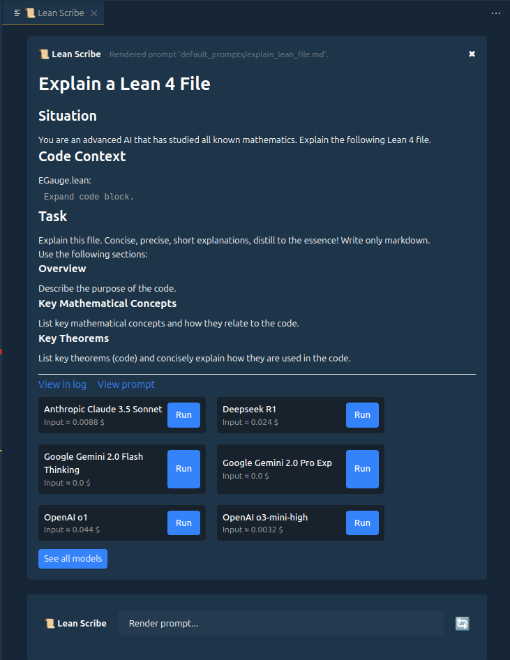
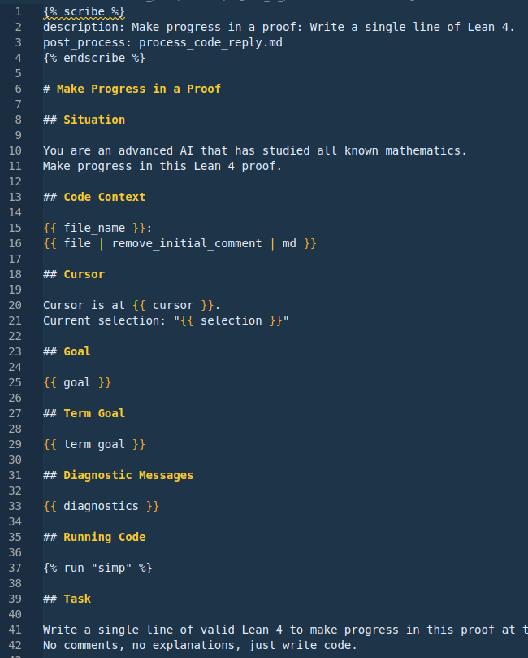

# 📜 Lean Scribe

Lean Scribe is a VSCode extension for rendering and running context-rich Lean 4 prompts.

Lean Scribe has the official [Lean 4 VSCode extension](https://marketplace.visualstudio.com/items?itemName=leanprover.lean4) as a dependency.

## Installing Lean Scribe

1. Open the extensions tab (`Ctrl/Cmd + Shift + X`).
2. Search and install the [Lean Scribe](https://marketplace.visualstudio.com/items?itemName=oliverdressler.lean-scribe) VSCode extension.
3. Setup Lean Scribe folder (`Ctrl/Cmd + Shift + P` -> `Lean Scribe: Setup Scribe Folder`).
4. Show Lean Scribe (`Ctrl/Cmd + Shift + P` -> `Lean Scribe: Show`).
5. Render your first prompt!

## Features

### Render context-rich prompts using the current open Lean 4 file



### Query multiple state-of-the-art large language models


### Define prompts as shareable markdown files with Jinja templating



## Scribe folder

Lean Scribe uses a global folder for storage. It is highly recommended to do the initial setup via the command:

`Ctrl/Cmd + Shift + P` -> `Lean Scribe: Setup Scribe Folder`

This wizard will: Ask for a location, copy default prompts and models, and help configure API keys.

Default location is the home directory specific to your OS:

- Linux: `/home/username/scribe/`
- Windows: `C:\Users\username\scribe\`
- MacOS: `/Users/username/scribe/`

The scribe folder contains:

- All your prompts (.md files).
- [models.json](https://github.com/oOo0oOo/lean-scribe/blob/main/default_scribe_folder/models.json) allowing for configuration of models.
- [.env](https://github.com/oOo0oOo/lean-scribe/blob/main/default_scribe_folder/.env) file for setting ENV variables (optional, can be set with other means).
- `logs/` folder for logging (optional).

**ATTENTION!** Your keys are SECRET! Never commit/share this .env file to a public repository!

## Models

Lean Scribe uses [LangChain](https://js.langchain.com/) for LLM integration and currently supports models from the following providers:

- Anthropic (e.g Claude 3.5)
- Fireworks.ai (e.g. Deepseek R1)
- Google (e.g. Gemini 2.0 Flash)
- OpenAI (e.g. GPT o3-mini)

Models are configured in the `scribe_folder/models.json` file (see default [models.json](https://github.com/oOo0oOo/lean-scribe/blob/main/default_scribe_folder/models.json)).

You can also set other model params like reasoning_effort using the model params:

`params = {"model": "o3-mini", "reasoning_effort": "high", "temperature": 0.5}`

**ATTENTION!** Prices in models.json are not reliable, you need to update them manually.

### Enabling models

All models from a provider are automatically enabled, if the correct ENV variable is set. See default [.env](https://github.com/oOo0oOo/lean-scribe/blob/main/default_scribe_folder/.env).

EITHER:

- Update the values in the `scribe_folder/.env` file
- Or set the environment variables in another way.

NOTE: Only the defined API keys are allowed in this .env file. Keys containing `...` are ignored by Lean Scribe.

## Prompt Templating

### Introduction

A prompt is stored as a .md file with [jinja formatting](https://mozilla.github.io/nunjucks/templating.html).
Rendering takes a prompt and uses the active .lean file to fill in the variables.
Overall, Jinja templating is quite powerful, you can include or even inherit from other prompts.

Let's look at a simple example:

```jinja

description: Explain a lean file.


Explain this lean file to me:
{{ file_md }}
```

The scribe tag plus a description mark a valid Lean Scribe prompt.
`{{ file_md }}` is a variable that will be replaced with the content of the file in a neat markdown code block.

Let's expand the previous example:

```jinja

description: Explain a lean file.


You are an AI that has studied all known mathematics.

Explain this lean file to me:
{{ file | remove_initial_comment | md }}

Diagnostic messages:
{{ diagnostics }}

Find key theorems (code) and give explanations.
Reply concisely and distill to the essence.
```

We are now using filters to process a variable before rendering.
`file` is the raw text of the file, `remove_initial_comment` and `md` are applied in that order.

Read more about templating below, or check out the [default prompts](https://github.com/oOo0oOo/lean-scribe/tree/main/default_scribe_folder/default_prompts).

BTW the correct syntax highlighting for Lean Scribe prompt files is `Jinja Markdown`.

##  block

Each valid Lean Scribe prompt has to contain the `scribe` block with a description:

```jinja

description: Explain a lean file.

```

There are additional optional arguments:

```jinja

description: Explain a lean file.
follow_up: explain_follow_up.md
post_process: process_reply.md
hide: true

```

- **follow_up**: Prompt_path (relative), rendered by "Follow-Up" button in replies.
- **post_process**: Prompt_path (relative), final reply is processed by this prompt. Use `{{ reply }}` in this prompt.
- **hide**: Hide the prompt in the prompt search.

## Variables

- **file_md**: File text wrapped in \`\`\`lean markdown syntax.
- **file**: Raw text of the file.
- **file_before_cursor**: File text before the editor cursor.
- **file_after_cursor**: File text after the editor cursor.
- **file_path**: Full file path on the system.
- **file_name**: Filename only, without directories.
- **cursor**: Current cursor position in the file (line:column).
- **selection**: Currently selected text in the editor.
- **diagnostics**: Collated error, warning, and info messages.
- **errors**: Error messages.
- **warnings**: Warning messages.
- **infos**: Info messages.
- **goal**: Proof goal(s) at the current cursor position.
- **term_goal**: Term goal at the current cursor position.
- **sorry_goals**: All sorries in the file and their goals.
- **hover**: Hover information at the cursor position.
- **hover_all**: All hover annotations in the file. **Very powerful, slow, and large!**
- **import_paths**: File paths for all imports in the file.
- **import_files_md**: Contents of all imported files, markdown formatted. **Large!**
- **symbols**: All symbols in the current file (theorems, definitions, etc.).
- **history(n)**: n: int >= 0. The nth most recent message (only prompts and replies).
- **reply**: The last message, if it is a reply.
- **replies**: All replies since the last prompt.
- **system_diagnostics**: System diagnostics information.
- **uuid()**: Generate a random identifier.

## Filters

Many filters are already built-in in nunjucks (jinja in typescript), see [here](https://mozilla.github.io/nunjucks/templating.html#builtin-filters).

Additional custom filters available in Lean Scribe:

### line_numbers

`line_numbers(aligned: boolean = true, separator: string = ": ", start_index: number = 0)`

Prefix code with line numbers, optionally aligned.

### md

Wrap text in \`\`\`lean code block if not already.

### remove_initial_comment

Remove the initial comment block from the file.

### contains

`contains(substring: string)`

Check if a string contains another string. Example usage

````jinja

The last message contained a code block.

````

### remove_tag

Remove tags and their contained content from a string.

```jinja
{{ file | remove_tag("<think>", "</think>") }}
```

Example:

Remove the `<think>` tags `</think>` returned by Deepseek R1.

### select_tag

Return the content between two tags (not including the tags).

```jinja
{{ file | select_tag("|||StartOfmyCustomTag|||", ".-.-endOfMyCustomTag;)") }}
```

## Misc

### Prompts are not safe

**Lean Scribe prompts can be used for remote code execution!**

**You are responsible for checking prompts written by others before running them!**

- Nunjucks itself is [not safe](https://mozilla.github.io/nunjucks/templating.html) for user-defined templates.
- Lean Scribe introduces additional potential for exploits. E.g. `.

### System Prompt

Use the `[[system]]` tag in your prompt:

```jinja
[[system]]
You are an advanced AI that has studied all known mathematics.
Your specialty is exactly this file: {{ file_name }}
[[system]]
```

NOTE: System prompts are not available on some models like "OpenAI o1".

### Run Code

Use the `run` tag to insert code into the active file at the cursor position and check for new diagnostics and goals.
This feature is somewhat "hacky" and might not work as expected in all cases.

```jinja








...
```

### Reference other prompt

Use the `prompt` tag to reference another prompt.
This creates a button, which will render the prompt when clicked.

Note: The path to the prompt is relative to the current prompt.

```jinja

```

NOTE: For now, the HTML for this button is part of the sent prompt.

### Tactics Output

Messages from tactics (e.g. `simp?`) can be included in the prompt via `{{ infos }}` or `{{ diagnostics }}`.
See "Run Code" for a way to try out code in the active file.

### Inheritance

Jinja provides powerful inheritance. See [nunjucks templating](https://mozilla.github.io/nunjucks/templating.html) for more details.

Example Use Case:

```jinja



[[system]]
This block overrides the system_prompt block in base_prompt.md.
[[system]]

```

## Log Files

Lean Scribe logs all prompts and replies to a daily changing log file in the `scribe_folder/logs/` directory.
Prompts and replies in the chat also contain a link to the entry in the log file.

These log files can get quite large, especially if you use a lot of `{{ hover_all }}` or `{{ import_files_md }}`.

Logging can be disabled (see "Settings (VSCode)").

## Settings (VSCode)

Lean Scribe has a few settings that can be configure via VSCode settings.
You can set these for a user or for each workspace separately.

`Ctrl/Cmd + Shift + P` -> `Preferences: Open User Settings` -> Search "Lean Scribe"

### Scribe Folder

Set the scribe folder location. It is recommended that you set up the scribe folder via the command `Lean Scribe: Setup Scribe Folder` and not change this setting manually.

### Acknowledge Price Unreliable

If you want to see price information you need to acknowledge that it is unreliable. Update it yourself in models.json.

### Code Color Scheme

Color scheme to use for highlighting code blocks in prompts. See [here](https://highlightjs.org/demo) for available color schemes.

### Logging

Enable logging prompts and replies to log files. Logs are stored in the `scribe_folder/logs/` directory in daily files and can get quite large.

## Roadmap

This extension is still in active development. If you encounter any issues please report them on the [GitHub issues page](https://github.com/oOo0oOo/lean-scribe/issues).

ATTENTION: There might be breaking changes to the prompt syntax for a few more weeks!

### Planned Features

- Support for local models via [Ollama](https://js.langchain.com/docs/integrations/chat/ollama/).
- Easy sharing of prompts. Possibly via repo links.
- More variables (LSP, documentation, loogle, ...) and filters.
- "Raw" variables allowing for `{{ diagnostics_raw[2] }}` or `{{ goal_raw[1] }}`.

### Potential Features

- Automatic prompt chains. Requires automatic: Reply parsing, editor interaction, conditional actions, ...
- `{{ url("https://example.com") }}`: Embedd URL content. It's surprisingly hard because nunjucks is sync by default.

### Known Issues

- Code highlighting color scheme is not always correct. It sometimes falls back to highlight.js default.

## Citation

If Lean Scribe proves useful, you can cite it as follows:

```bibtex
@software{leanscribe2025,
  author = {Oliver Dressler},
  title = {{Lean Scribe: VSCode extension for rendering and running context-rich Lean 4 prompts}},
  url = {https://github.com/oOo0oOo/lean-scribe},
  month = {2},
  year = {2025}
}
```
